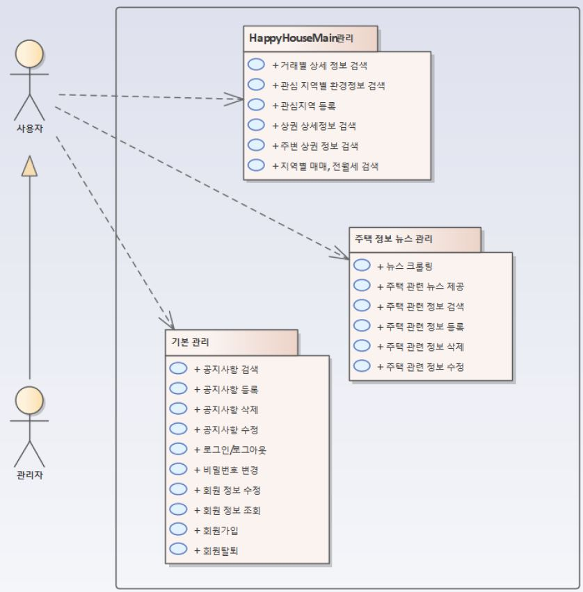
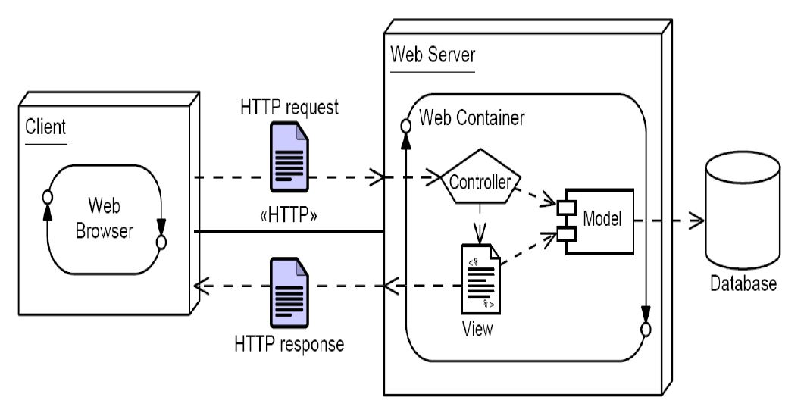

# :house: 2021 HappyHouse_Web_Project :house:

- **부동산거래(주택/아파트 매매와 월세) 웹서비스**  
    *- 부동산 거래 외 주변 상권 정보, 날씨정보, 환경정보 등 다양한 기능 제공 -*

- :white_check_mark: 사용자 요구사항  
</img>
    

## :mag: 개발환경

```java
1. 개발IDE - Eclipse IDE for Java EE Developer<br/>
2. Tomcat - Apache Tomcat 9.0<br/>
3. MySQL - MySQL 8.0 <br/>
```

## :loudspeaker: 기본 UI

- **회원가입**  
</img>

- **로그인 완료 및 메인**  
</img>

- **카테고리(시, 군, 구) 선택**  
</img>

- **마커 선택시 확대 및 최저가**  
</img>


## :open_file_folder: ER DIAGRAM (보완중)
</img>


## :1234: 구현스택

1. 기본 JAVA 코드 구현
2. FRONTEND 설계
3. DB 설계
4. MVC PATTERN으로 구현
5. DB 연동 및 MVC 확대

## :round_pushpin: 프로젝트 구조
- **Model-View-Controller구조 FLOW**  

</img>
1. *Model – JavaBean DI 및 어노테이션 활용(Business layer)*
2. *View – JSP, HTML, Ajax 등을 이용(Presentation layer)*
3. *Controller – Client로부터 HTTP Request수신*

## :girl::boy: Author
[Sujin](https://github.com/SujinJeong)
- Blog : https://blog.naver.com/lovesujin051
- E-mail : lovesujin05173@gmail.com

